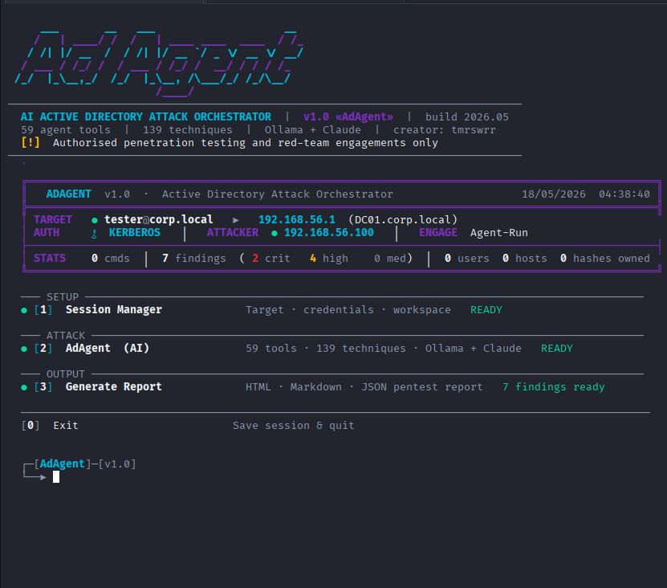
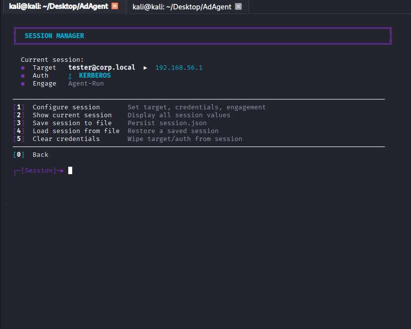
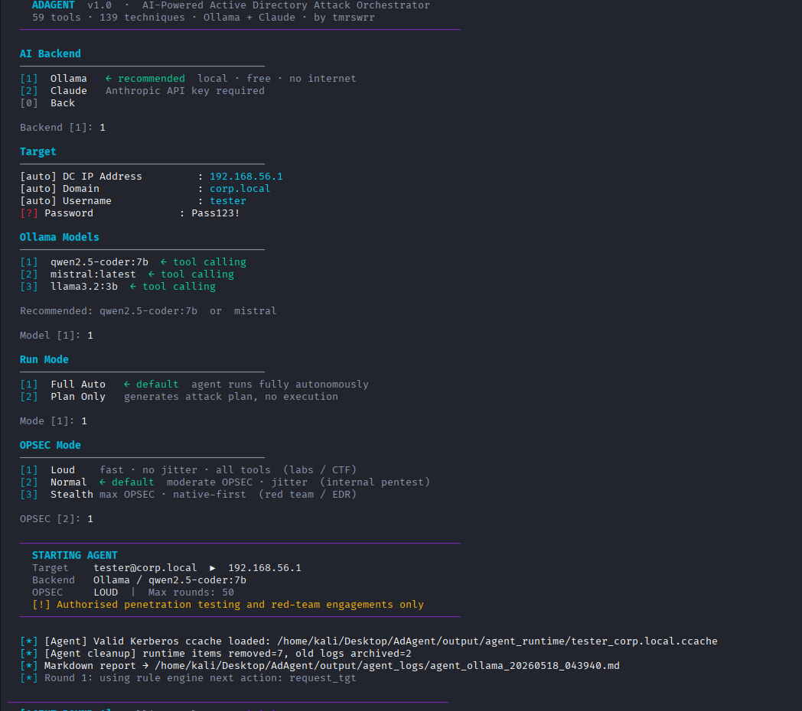
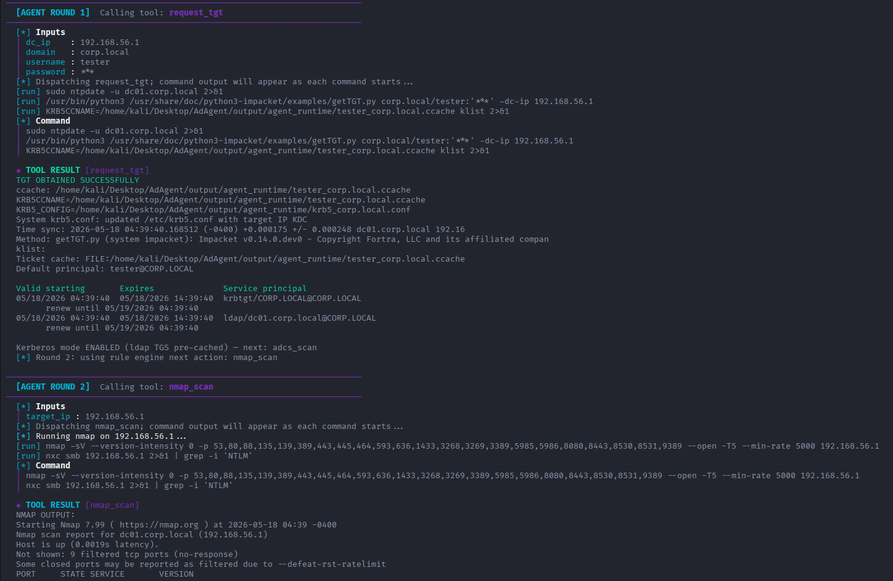
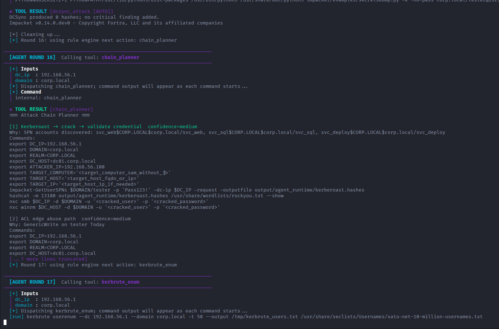
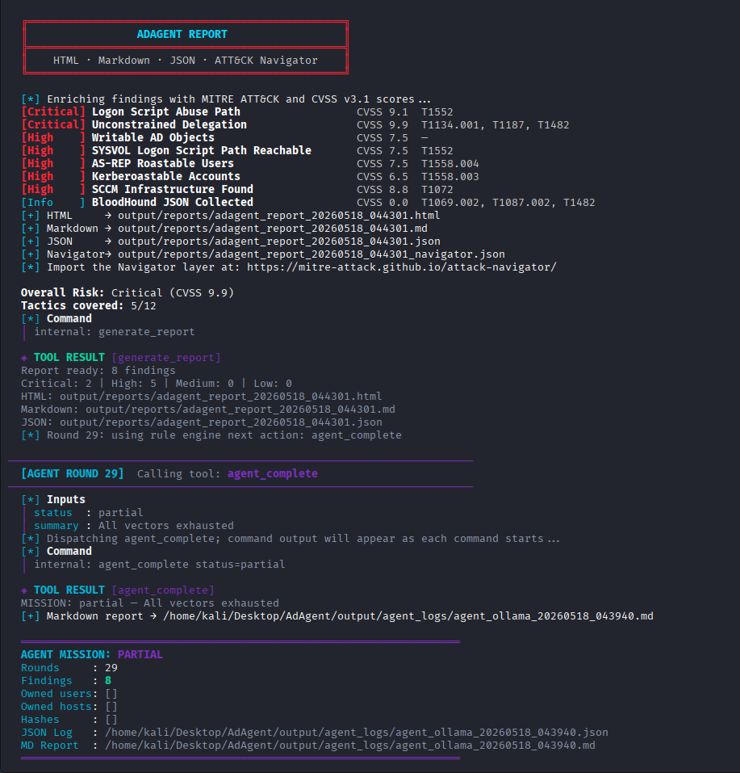
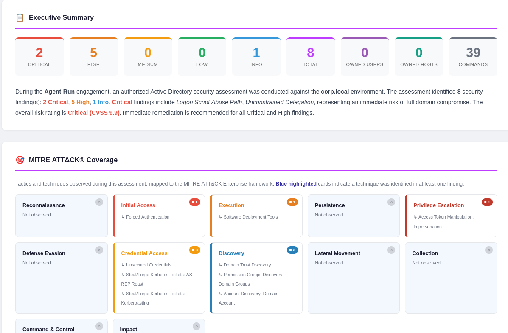
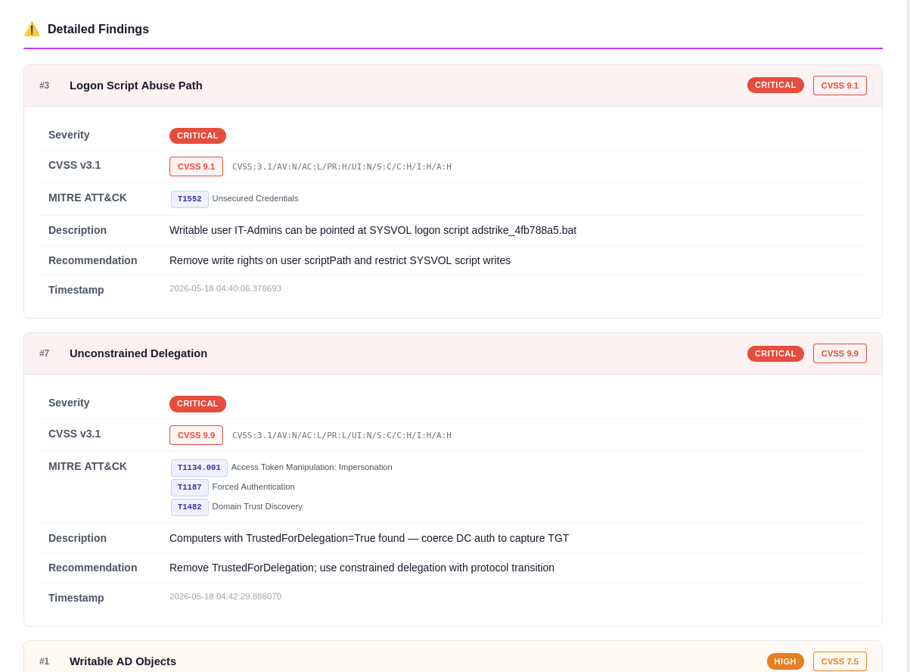

<p align="center">
  
</p>

<p align="center">
  
  
  
  
  
  
</p>

<p align="center">
  <b>AI-Powered Active Directory Attack Agent</b><br/>
  <sub>59 tools · 139 techniques · Autonomous kill-chain execution · Ollama + Claude</sub>
</p>

---

> **Authorized use only. Do not run this tool against systems without explicit written permission.**
> This tool automates offensive AD techniques that can cause account lockouts, service disruption, or domain compromise.

---

## Overview

**AdAgent** is a standalone autonomous agent that chains Active Directory offensive techniques automatically using an AI backend (Ollama or Claude). It drives the full kill chain — from initial enumeration through domain compromise — without manual intervention, while tracking evidence, adapting to dead paths, and producing structured pentest reports.

## Main Menu

<p align="center">
  
</p>

The main menu shows a live dashboard with target, auth mode, attacker IP, findings severity breakdown, and session stats — all updated in real time. Green dots indicate ready state; menu items show `READY` or `SESSION REQUIRED` based on current configuration.

---

## Quick Start

```bash
git clone https://github.com/capture0x/AdAgent.git
cd AdAgent
chmod +x install.sh run.sh
./install.sh
cp .env.example .env
nano .env          # set DC_IP, DOMAIN, USERNAME, PASSWORD
./run.sh
```
## How to use 

[](https://youtu.be/guLQGFbiNHw?si=7lcvTkYxGAxde4X-)

### AI Backend Setup

**Ollama (local, free — recommended):**
```bash
ollama pull qwen2.5-coder:7b
ollama serve
```

**Claude API:**
```bash
# Add to .env:
ANTHROPIC_API_KEY=sk-ant-...
```

### Interactive Menu Options

```bash
./run.sh              # interactive menu
./run.sh --agent      # launch agent directly (skip menu)
./run.sh --session path/to/session.json
./run.sh --no-banner
```

---

## CLI Mode

Skip the interactive menus entirely — pass all settings as flags and the agent starts immediately.

```bash
chmod +x adcli.sh run.sh
```

### Password Auth — Ollama (local, free)

```bash
./run.sh --dc 10.10.10.10 --domain corp.local --user john --pass Password123 \
         --attacker 10.10.14.5 --opsec normal
```

### NT Hash / Pass-the-Hash — Claude

```bash
./run.sh --dc 10.10.10.10 --domain corp.local --user administrator \
         --hash aad3b435b51404eeaad3b435b51404ee:abc123def456... \
         --backend claude --model sonnet --opsec loud
```

### Kerberos ccache

```bash
./run.sh --dc 10.10.10.10 --domain corp.local --user john \
         --ccache /tmp/john.ccache --opsec stealth
```

### NULL Session (no credentials)

```bash
./run.sh --dc 10.10.10.10 --domain corp.local --opsec normal
```

### Plan Only — generate attack plan without executing tools

```bash
./run.sh --dc 10.10.10.10 --domain corp.local --user john \
         --pass Password123 --mode plan
```

### All CLI Flags

| Flag | Description | Default |
|---|---|---|
| `--dc` | Domain Controller IP | **required** |
| `--domain` | AD domain (e.g. `corp.local`) | **required** |
| `--user` | Username (omit for NULL session) | — |
| `--pass` | Plaintext password | — |
| `--hash` | NT hash (`LM:NT` or just `NT`) | — |
| `--ccache` | Kerberos ccache file path | — |
| `--attacker` | Your listener / attacker IP | — |
| `--engagement` | Engagement name for reports | — |
| `--backend` | `ollama` or `claude` | `ollama` |
| `--model` | Model name or alias (`opus`/`sonnet`/`haiku` for Claude) | auto |
| `--api-key` | Anthropic API key (or set `ANTHROPIC_API_KEY` env var) | — |
| `--opsec` | `loud` · `normal` · `stealth` | `normal` |
| `--mode` | `auto` = full run · `plan` = text plan only | `auto` |
| `--rounds` | Override max agent rounds | built-in limit |
| `--yes` | Skip 5-second confirmation countdown | — |
| `--no-banner` | Suppress ASCII banner | — |

> **Routing:** `./run.sh` auto-detects CLI mode when `--dc` or `--domain` is present and routes to `cli/adcli.py`. Without those flags it opens the interactive menu as usual.

### CLI Mode File Structure

```
AdAgent/
├── adcli.sh          ← standalone CLI launcher (alternative to run.sh)
└── cli/
    ├── adcli.py      ← entry point
    ├── args.py       ← argument parser
    ├── display.py    ← banner, profile table, countdown
    └── runner.py     ← session injection + agent launch
```

---

## Screenshots

### Session Manager

<p align="center">
  
</p>

Session Manager displays the current target, auth mode, and engagement name. Provides five options: Configure, Show, Save, Load, and Clear credentials.

---

### Agent Setup — Backend, Model & OPSEC

<p align="center">
  
</p>

Clean setup flow: choose AI backend (Ollama recommended / Claude API), enter target credentials (auto-filled from session), pick a tool-calling model, select run mode (Full Auto or Plan Only), and configure OPSEC level (Loud / Normal / Stealth). A launch summary bar confirms all settings before the agent starts.

---

### Agent Running — Live Tool Execution

<p align="center">
  
</p>

The agent executes tools round by round, displaying inputs, commands, and results in real time. Color-coded output: **green** for success/findings, **violet** for errors, **yellow** for warnings. Each round is logged to a live Markdown report.

---

### Chain Planner — Attack Path Analysis

<p align="center">
  
</p>

After enumeration, the `chain_planner` tool ranks discovered attack vectors by confidence and generates ready-to-run command sequences for each path — Kerberoast, ACL abuse, gMSA takeover, ADCS ESC, and more.

---

### Mission Complete — Summary

<p align="center">
  
</p>

At mission end the agent displays a structured summary: rounds completed, findings by severity, owned users and hosts, captured hashes, and paths to all generated reports (HTML, Markdown, JSON, ATT&CK Navigator).

---

### HTML Report — Executive Summary & MITRE ATT&CK Coverage

<p align="center">
  
</p>

The professional HTML report opens with an executive summary: stat cards for each severity level, total findings, owned users/hosts, and commands run. Below is an auto-generated narrative paragraph. The **MITRE ATT&CK® Coverage** section maps every finding to the enterprise framework, highlighting which tactics were observed.

---

### HTML Report — Detailed Findings with CVSS v3.1

<p align="center">
  
</p>

Each finding card shows severity badge, **CVSS v3.1 score and vector**, MITRE ATT&CK technique IDs (clickable links to attack.mitre.org), description, recommendation, and timestamp. The report also includes compromised assets, attack timeline, and an ATT&CK Navigator layer JSON.

---

## Features

| | |
|---|---|
| **59 Agent Tools** | Full kill chain: recon → enum → creds → privesc → lateral → DA |
| **139 SAST Techniques** | 22 YAML categories injected into AI system prompt |
| **AI Backends** | Ollama (local/free) · Anthropic Claude (API) |
| **Auth Modes** | Password · NT Hash (PTH) · Kerberos ccache |
| **OPSEC Modes** | `loud` · `normal` · `stealth` |
| **Dead-Path Tracking** | Per-principal loop prevention |
| **Auto-Reporting** | Live Markdown + HTML + JSON + ATT&CK Navigator |
| **MITRE ATT&CK** | CVSS v3.1 scoring, technique enrichment, tactic coverage map |

---

## All 59 Tools

<details>
<summary><b>Reconnaissance & Discovery</b></summary>

| Tool | Description |
|---|---|
| `nmap_scan` | Port scan, OS, domain, clock skew |
| `kerbrute_enum` | Username enumeration over Kerberos |
| `no_cred_surface_recon` | LDAP rootDSE, SMB null/guest, HTTP/ADCS/WSUS surface |
| `rediscover_target` | Re-run LDAP/NXC/nmap discovery mid-engagement |

</details>

<details>
<summary><b>Enumeration</b></summary>

| Tool | Description |
|---|---|
| `enumerate_ldap` | Users, groups, GPOs, trusts, SPNs, LAPS, delegation |
| `enumerate_shares` | SMB shares, SYSVOL, GPP password files |
| `collect_bloodhound` | BloodHound data collection with fallbacks |
| `query_bloodhound_paths` | Neo4j shortest path queries |
| `user_hunt` | Session hunting, PSRemoting checks |

</details>

<details>
<summary><b>Credential Attacks</b></summary>

| Tool | Description |
|---|---|
| `asrep_roast` | AS-REP roastable account hashes |
| `kerberoast` | SPN account roasting |
| `targeted_kerberoast` | Targeted SPN abuse via writable account |
| `password_spray` | Credential spraying with jitter |
| `timeroast` | MS-SNTP NTP hash extraction (no creds) |
| `pre2k_attack` | Pre-Windows 2000 default password abuse |

</details>

<details>
<summary><b>Privilege Escalation</b></summary>

| Tool | Description |
|---|---|
| `adcs_scan` | ADCS ESC1–ESC13 enumeration and exploitation |
| `shadow_credentials_attack` | msDS-KeyCredentialLink injection |
| `acl_abuse_scan` | GenericWrite/WriteDACL/ForceChangePassword edges |
| `force_change_password_pivot` | Reset user via ForceChangePassword ACE |
| `rbcd_attack` | RBCD full chain |
| `unconstrained_delegation` | TGT capture via coercion |
| `local_privesc_chain` | Potato, AlwaysInstallElevated, unquoted paths |
| `jea_enum` | JEA endpoints, PSReadLine history |
| `windows_privesc_recon` | Post-shell local escalation recon |

</details>

<details>
<summary><b>Lateral Movement & Shell</b></summary>

| Tool | Description |
|---|---|
| `evil_winrm` | WinRM shell (password / hash / Kerberos) |
| `discover_winrm_access` | Find WinRM-accessible hosts |
| `lateral_movement` | WMI / WinRM / PSExec-style execution |
| `mssql_abuse` | xp_cmdshell, linked server RCE |
| `logon_script_abuse` | Writable scriptPath abuse |

</details>

<details>
<summary><b>Credential Access</b></summary>

| Tool | Description |
|---|---|
| `dcsync_attack` | Full domain hash dump |
| `credential_dump` | Remote LSASS / SAM / NTDS |
| `credential_loot` | Post-exploitation credential hunting |
| `laps_read` | LAPS local admin password |
| `shadow_copies_dump` | VSS-based NTDS.dit and SAM extraction |
| `auto_loot_chain` | Shares → parse creds → test → pivot |

</details>

<details>
<summary><b>gMSA · Certificates · Kerberos</b></summary>

| Tool | Description |
|---|---|
| `gmsa_read` | Read gMSA managed password |
| `gmsa_takeover` | Modify msDS-GroupMSAMembership → dump hash |
| `bloodyad` | Generic LDAP object operations |
| `pass_the_cert` | PKINIT → NT hash |
| `golden_ticket` | Forge TGT using krbtgt hash |
| `silver_ticket` | Forge TGS using service account hash |
| `request_tgt` | Obtain Kerberos TGT |

</details>

<details>
<summary><b>Cloud / Hybrid / ADFS / SCCM / WSUS</b></summary>

| Tool | Description |
|---|---|
| `adfs_attack` | DKM cert, Golden SAML, MSOL DCSync |
| `sccm_abuse` | NAA credentials, client push relay |
| `wsus_attack` | HTTP vuln check, pywsus injection |
| `trust_attack` | Trust key, SID history, cross-domain |
| `trust_chain_planner` | ExtraSID plan, cross-forest Kerberoast |
| `gpo_abuse` | GPO create / link / exec / hijack |
| `adidns_abuse` | DNS wildcard, WPAD, record injection |
| `rodc_attack` | RODC PRP, Key List, RODC Golden Ticket |
| `coercion_attack` | PrinterBug / PetitPotam / Coercer |

</details>

<details>
<summary><b>OPSEC & Utility</b></summary>

| Tool | Description |
|---|---|
| `opsec_check` | EDR/AV/Sysmon/MDI/LAPS detection |
| `c2_stage` | Sliver / Havoc / MSF payload + delivery |
| `test_credential` | Test creds across SMB/LDAP/WinRM |
| `update_session` | Persist discovered intel |
| `chain_planner` | Rank attack chains from evidence |
| `generate_report` | HTML · Markdown · JSON · ATT&CK Navigator |
| `agent_complete` | End mission with summary |

</details>

---

## Configuration (`.env`)

```env
DC_IP=10.10.10.10
DOMAIN=corp.local
USERNAME=john.doe
PASSWORD=Password123
# NT_HASH=aad3b435b51404ee...  (alternative to PASSWORD)
ATTACKER_IP=10.10.14.5
ENGAGEMENT_NAME=Corp-Pentest-2026
ANTHROPIC_API_KEY=          # leave blank for Ollama
ADSTRIKE_OPSEC=normal       # loud | normal | stealth
```

---

## Output

```
output/
├── session.json                     ← persistent session state
├── agent_logs/
│   ├── agent_<ts>.md                ← live Markdown round-by-round report
│   └── agent_<ts>.json              ← JSON conversation log
└── reports/
    ├── adagent_report_<ts>.html     ← full HTML pentest report
    ├── adagent_report_<ts>.md       ← Markdown report
    ├── adagent_report_<ts>.json     ← JSON findings export
    └── adagent_report_<ts>_navigator.json  ← ATT&CK Navigator layer
```

---

## Prerequisites

```bash
# System tools
sudo apt install -y impacket-scripts nxc evil-winrm bloodhound-python \
  certipy-ad ldap-utils krb5-user nmap responder coercer seclists

# Python packages
pip install -r requirements.txt

# Optional
pip install bloodyad lsassy dploot roadtx roadrecon sccmhunter pywsus
```

---

## Documentation

Full operator guide: [`docs/ADAGENT_GUIDE.md`](docs/ADAGENT_GUIDE.md)

Covers: session model, all 59 tools, SAST knowledge base, decision engine priority ladder, gMSA/ADCS/BloodHound/ADFS/WSUS/Trust workflows, loop guards, troubleshooting, development guidelines, and operator checklist.

---

## Relation to AdStrike

AdAgent is the agent-only extraction of **[AdStrike](https://github.com/capture0x/AdStrike)** — the full 56-module interactive AD attack framework.

| | AdAgent | AdStrike |
|---|---|---|
| AI Agent | ✅ Full (59 tools) | ✅ Full |
| Interactive Modules | ❌ | ✅ 56 modules |
| Best for | Autonomous runs | Manual + AI hybrid |

---

## Disclaimer

AdAgent is intended exclusively for **authorised security testing**, red team engagements, and educational lab use. The authors accept no responsibility for misuse. Always obtain written permission before testing any system you do not own.

Password spraying can lock accounts. DCSync, DCShadow, ADCS exploitation, and coercion attacks are high-impact — use only with explicit scope approval.

---

<p align="center">
  <b>Creator:</b> tmrswrr &nbsp;·&nbsp;
  <b>GitHub:</b> <a href="https://github.com/capture0x">capture0x</a> &nbsp;·&nbsp;
  <b>Framework:</b> AdStrike v5.0 «AdStrike» &nbsp;·&nbsp;
  <b>License:</b> MIT
</p>
